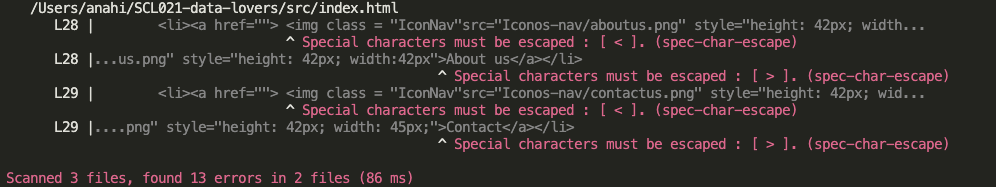

## Índice

* [1. Proyecto Pokepedia](#1-Proyecto Pokepedia)
* [2. Historias de Usuario](#2-Historias de Usuario)
* [3. Prototipo de baja fidelidad ](#3-Prototipo de baja fidelidad)
* [4. Prototipo de alta fidelidad ](#4-Prototipo de alta fidelidad)
* [5. Test Unitario](#5-Test Unitario)
* [6. Producto final](#6-Producto final)

***

## 1. Proyecto Pokepedia

Pokémon GO es una experiencia de juego internacional donde cada usuario puede convertirse en "Maestro Pokémon" con el objetivo de buscar, capturar y/o luchar con personajes de la saga Pokémon que se encuentran escondidos en diferentes locaciones del mundo real.

Dentro de las funcionalidades del juego los usuarios pueden:

- Descubrir el mundo Pokémon: explorar y descubrir nuevos Pokémon allá donde vayan.
- Atrapar distintos Pokémon para completar su Pokédex.
- Pelear contra Pokémon de otros entrenadores y conquistar un gimnasio.
- Competir en épicos combates contra otros entrenadores.
- Hacer equipo con otros entrenadores para atrapar poderosos Pokémon durante las incursiones.

Mediante "Pokepedia" proporcionaremos a distintos tipos de usuarios la información necesaria para que puedan cumplir con sus objetivos a través de una página web intuitiva y armoniosa en término de paleta de colores e interacción, para así poder divertirse al máximo mientras juegan PokemonGo.

Adicionalmente, para mayor interacción, agregamos una ruleta que despliega los elementos de cada Pokémon para que el usuario pueda observar los elementos específicos, como así también el detalle de cada uno de estos.

## 2. Historias de Usuario

- Como entrenador quiero tener pokemones del mismo elemento para coleccionarlos.

* [ ] La sección “Types” cuenta con la ruta de destino (Home, Pokedex, etc)
* [ ] La sección "Types” tiene el menú que despliega la evolución del pokemon
* [ ] La sección “Types” cuenta con un botón para subir la página
* [ ]  Cada pokémon tiene sus fotos correspondientes
* [ ] Cada pokémon tiene información sobre: nombre, tipo, número, descripción, región.

- Como entrenador quiero capturar pokemones para batallar en los gimnasios.

- Como entrenador quiero saber los puntos de combate que tendrá mi pokemon al evolucionar para ganar en las batallas informales .

## 3. Prototipo de baja fidelidad

* [ ] Pasa tests (`npm test`)
* [ ] Pruebas unitarias cubren un mínimo del 70% de statements, functions y
  lines y branches.
* [ ] Incluye Definición del producto clara e informativa en `README.md`.
* [ ] Incluye historias de usuario en `README.md`.
* [ ] Incluye sketch de la solución (prototipo de baja fidelidad) en
  `README.md`.
* [ ] Incluye Diseño de la Interfaz de Usuario (prototipo de alta fidelidad)
  en `README.md`.
* [ ] Incluye link a Zeplin en `README.md`.
* [ ] Incluye el listado de problemas que detectaste a través de tests de
  usabilidad en el `README.md`.
* [ ] UI: Muestra lista y/o tabla con datos y/o indicadores.
* [ ] UI: Permite ordenar data por uno o más campos (asc y desc).
* [ ] UI: Permite filtrar data en base a una condición.
* [ ] UI: Es responsive.